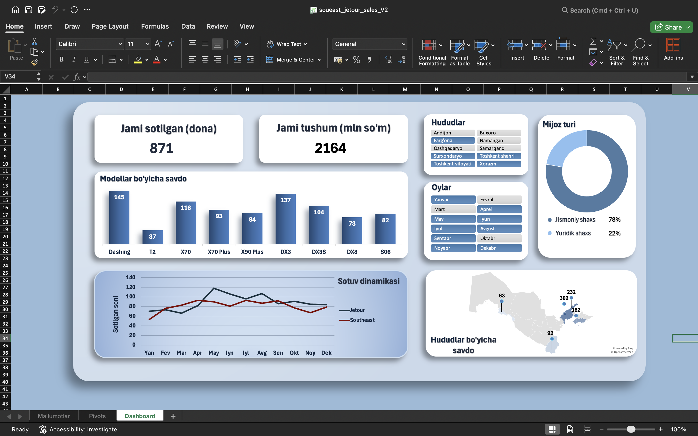

# Car Sales Dashboard (Excel)

An interactive car sales dashboard built in Excel, covering the **Jetour** and **Soueast** car brands along with detailed information about their individual models. The goal was to bring together sales trends, regional performance, and customer insights into a single, easy-to-read view.

## 📊 Features

- 📈 **Line Chart** — Shows how many cars were sold throughout the year, split into two lines comparing Jetour and Soueast sales side by side, making it easy to spot trends and seasonal patterns.
- 🗺️ **Interactive Map** — Displays the number of cars sold in each region using clean, functional pin indicators. The map updates dynamically whenever the time slicer is changed, giving a real-time view of regional performance.
- 🍩 **Donut Chart** — Illustrates the percentage breakdown of customers by type, distinguishing between Individual and Legal Entity buyers.
- 📊 **Bar Chart** — Highlights the number of car models sold within the selected region and time period, making it simple to identify top-performing models.
- 🧾 **Summary Cards** — Provide a quick, high-level overview of total units sold and net revenue at a glance.

## Dashboard Preview

## ▶️ How to Use

> [!Note]
> This project was created on macOS, so some minor visual or formatting issues may occur on Windows.
1. Download the file
2. Open it in Excel (before opening the file, click 'Enable Macros' in order for the visuals to work correctly and smoothly)
3. Use the slicers to filter by time period and region
4. Explore the interactive map, charts, and summary cards

## 🛠️ Built With

- Microsoft Excel (PivotTables, PivotCharts, Slicers, Map Chart, VBA)

## 📌 Notes

- Data is filtered dynamically — all visuals update together when a slicer selection changes.
- Designed for quick, at-a-glance business insights into brand performance, regional trends, and customer segmentation.
